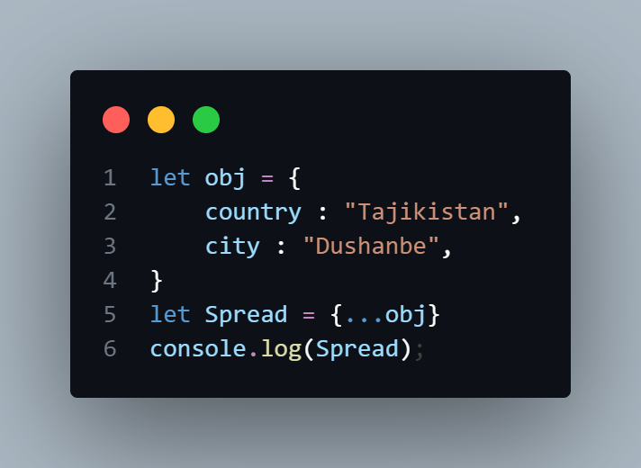

# JAVASCRIPT
# Table Of Contents
# 1.Object
# 2.Destructuring
# 3.Spread
# 4.this
# What is Object in JavaScript?
## Object in colleksiyai propertiho ast va properti in svyaz dar bayni klyuch va znacheniye ast, Objecti Js-ro mo metavonem bo objecthoi zindagi misol ovarem!
## Masalan Odam bisyor property dorad - name,age,surname,married,height,weight and others;
## Objecti JavaScript neprimitivniy data type ast:

# Methods of JS:
## 1.Object.entries() - harduyi klyuch va propertii moro dar do massivi otdelniy nishon medihad!

## 2.Object.keys() - klyuchhoi objecti moro nishon medihad!

## 3.Object.values() - qimathoi objecti moro nishon mediham!

# What is Destructuring and Spread in JavaScript?
## Destructuring dar JS behtarin namudi functsiyai baroi propertihoro az object qirifta va ba variableho bakhshidan ast ,Destrukturizatsiya boz metavonad yakchand propertihoro dar 1 variable bakhshad

# Spread:
